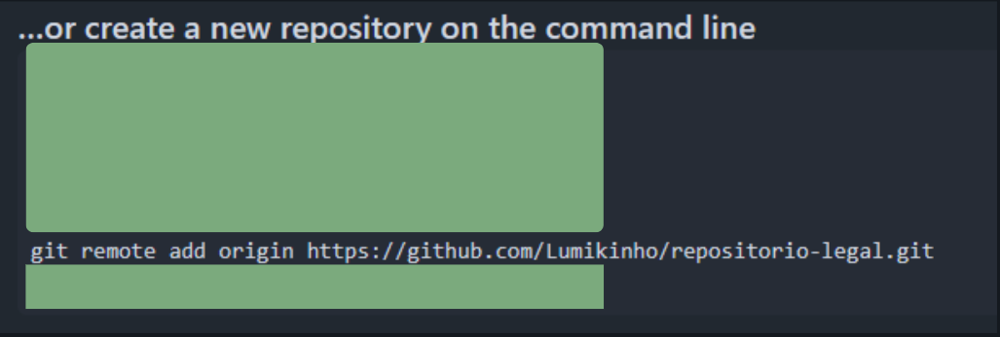
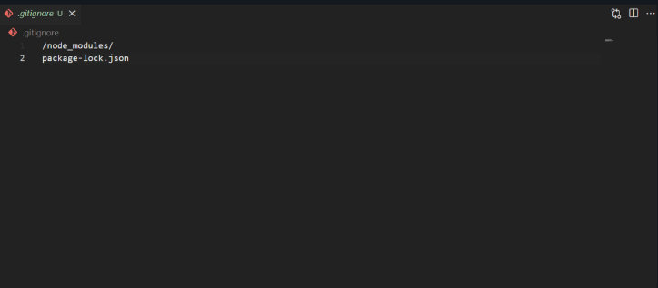

# Como colocar o meu projeto para o git?

1. Vá para [github.com](github.com) e cria sua conta caso não tenha

   1.1 Quando acessar o Dashboard do site e crie um repositorio.
   

   1.2 Depois configure o repositorio de acordo com as suas necessidades.
   

   - obs: Caso deseje deixar o repositorio privado você terá que adicionar um colaborador nas configurações do repositorio para alguem ter acesso a ele.

    1.3 Com tudo certo você tem um repositorio criado no github
     

2. Vamos adicionar os arquivos do seu projeto para o repositorio
   
   - Obs: Antes que qualquer coisa você tera que instalar o [Git](https://git-scm.com/) para subir seus projetos para o repositorio, TODOS os codigos deverão ser feitos no terminal dentro da pasta do projeto!

   2.1 Inicie uma branch local no seu projeto:
   ``` 
                                    git init 
   ```
    2.2 Adicione o link do repositorio remoto ao seu projeto:
   ```
                git remote add origin 'link do repositório'
   ```
   - Dica: o próprio Github oferece o comando
    

    2.3 Adicione uma branch (server como versões do seu codigo)
    ```
        git branch -M 'Nome da branch'
    ``` 
        
    - Obs: -M para ser a sua branch principal
    - Para verificar se você esta na branch certa digite ``` git branch ``` no terminal
    
    2.3,5 Caso necessario Adicione um arquivo .gitignore e dentro dele coloque todos os arquivos e pastas que NÃO irão ser adicionados ao git!
             
   
    2.4 Agora Adicione os arquivos para ir ao repositorio e faça um commit
        ```

        git add .

        git commit -m "(coloque aqui o que você vai adicionar ou modificar os arquivos)"
        
        
    - Altere o "(coloque aqui o que você vai adicionar ou modificar os arquivos )" com a sua mensagem!
    - Obs: ``` Git add . ``` é ultilizado para adicionar TODOS os arquivos que estão na pasta (menos o que estão listados no .gitignore) 
    - O ``` git commit -m "(Sua mensagem aqui)" ``` é ultilizado para commitar o codigo (adicionar uma versão do arquivo) ao repositorio.

    2.5 Com tudo pronto rode o comando ``` git push --set-upstream origin (sua branch) ``` para adicionar todos os arquivos ao repositorio.


